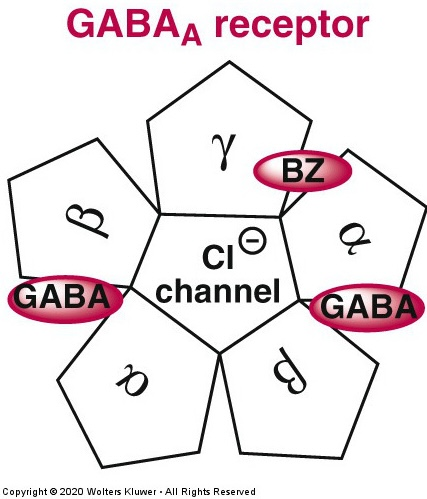
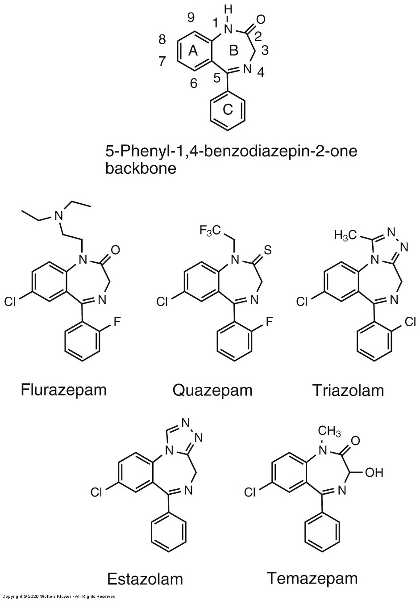
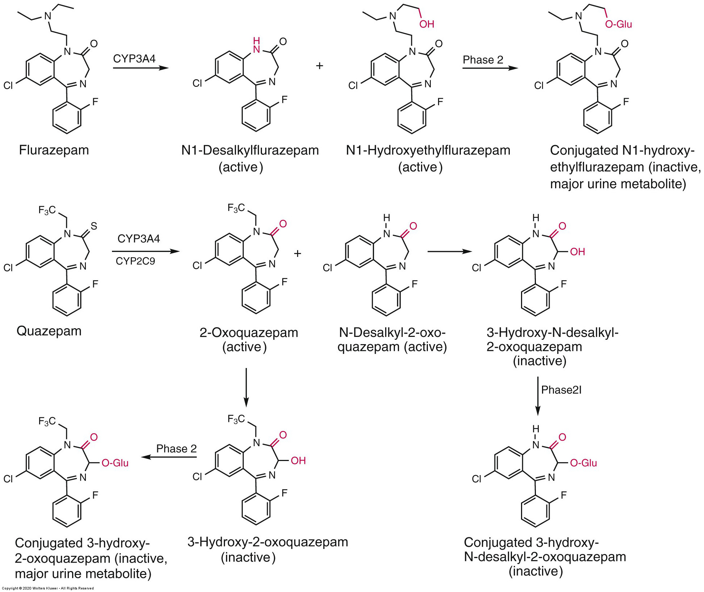
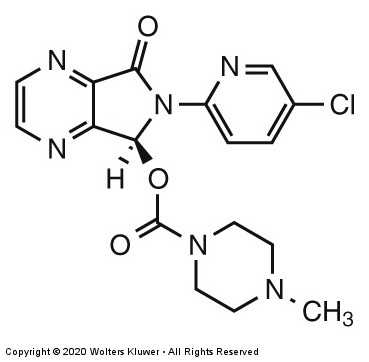
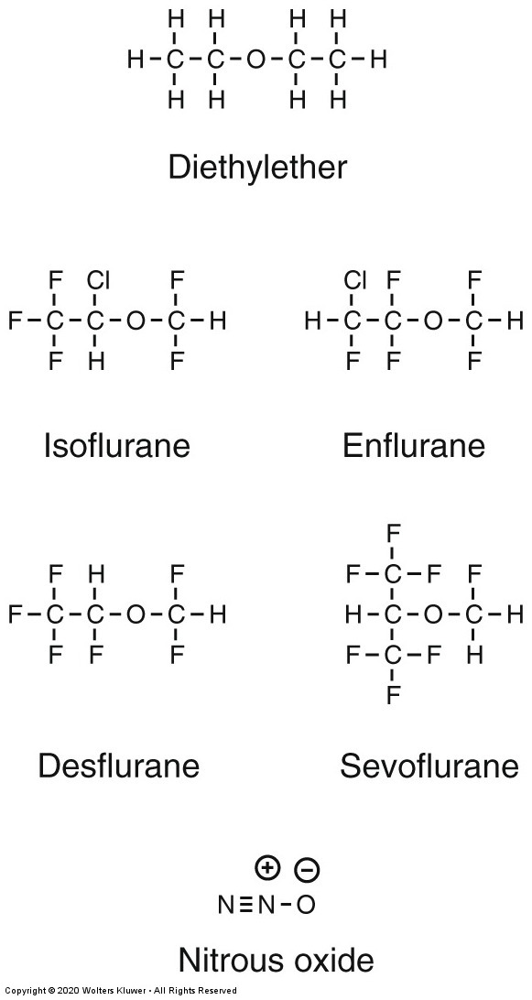
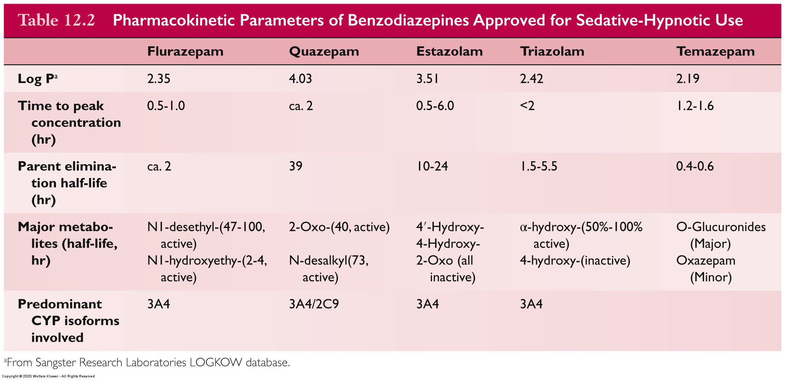
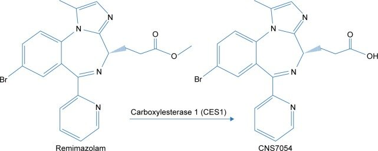

# Medicinal Chemistry of Benzodiazepine Sedative-Hypnotics
**PHA 548 – Hampton University**  
**Reference:** Foye’s Principles of Medicinal Chemistry, 8th Ed.

---

## Mechanism of Action — GABAA Allosteric Modulation

BZDs bind at **α-γ interface** of GABAA → ↑ **frequency** of channel openings.  
Require **endogenous GABA** → overdose safety advantage vs barbiturates.

---

## Required Pharmacophore

Three essential structural elements:

- **C7 electronegative substituent**
- **N1-C2 carbonyl**
- **C5 phenyl (Ring C)**

---

## Structure–Activity Relationships (SAR)

| Modification | Consequence |
|-------------|-------------|
| Remove C7-Cl | ↓ potency / ↓ affinity |
| Add C3-OH | Faster clearance via conjugation |
| Add bulky group para-C5 | Inactive (steric hindrance) |
| Triazolo/imidazo fusion | Protects oxidative soft spots |
| Ester appendage | Ultra-short, soft-drug behavior |

> Medicinal chemistry controls: potency, selectivity, duration, toxicity.

---

## PK-Driven SAR Examples

### Flurazepam & Quazepam  
Long-acting **active metabolites** → residual sedation

---

### Temazepam  
**Phase II** route → rapid offset

---

### Triazolobenzodiazepines  
Block oxidation with **fused ring**

---

## Comparative PK Table

| Drug | Major Metabolic Route | Approx. Outcome |
|------|----------------------|----------------|
| Flurazepam | CYP N-dealkylation | Very long-acting |
| Quazepam | CYP oxidation | Accumulation |
| Estazolam | CYP3A4 | Moderate duration |
| Triazolam | Oxidation → conjugation | Short-acting |
| Temazepam | Glucuronidation | Rapid clearance |
| Remimazolam | Ester hydrolysis | Ultra-short |

---

## Remimazolam — Soft-Drug Strategy

- Ester easily hydrolyzed → non-BZD inactive metabolite  
- Precise sedation onset/offset  
- Minimal hepatic metabolism

---

## Practice — Predicting Effects

Given a structure, predict:
1) **Binding** change  
2) **Duration** change  

*Explain in SAR terms.*

---

### Key Concept Summary

| Design Feature | Clinical Effect |
|---------------|----------------|
| ↑ Lipophilicity | ↑ CNS entry & duration |
| N-alkyl chains | Long-acting metabolite formation |
| C3-OH | Rapid conjugation & clearance |
| Fused rings | Metabolism protection → shorter |
| Soft-drug ester | Fast turnover → procedural control |

---

📌 End of Lecture Notes
