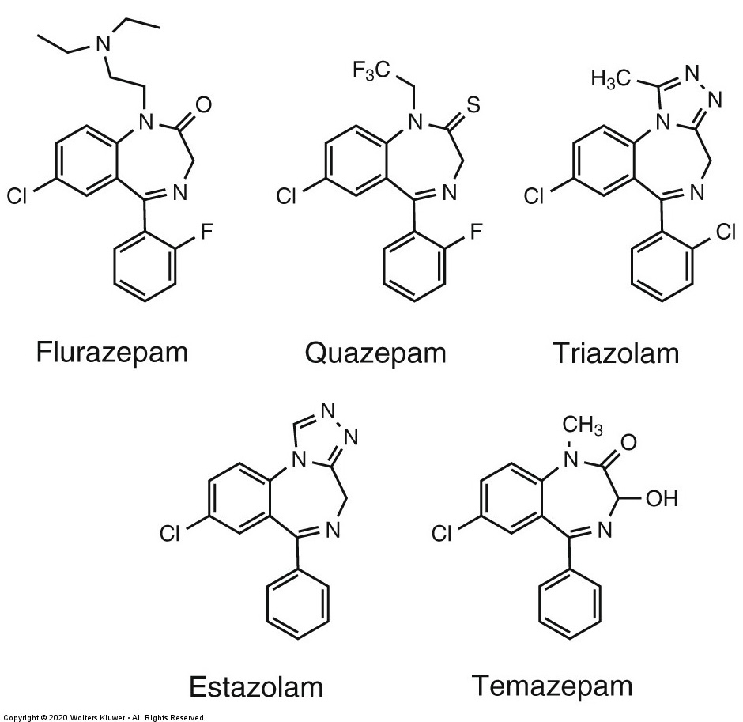
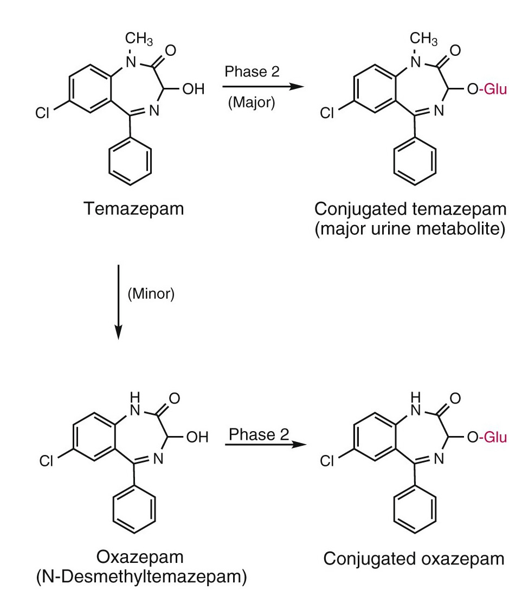

--- 
marp: true
theme: default
paginate: true
title: Medicinal Chemistry of Benzodiazepine Sedative-Hypnotics
footer: "PHA 548 – Hampton University"
---

# 🧬 Medicinal Chemistry of Benzodiazepine Sedative-Hypnotics
**Course:** PHA 548 Pharmacology & Medicinal Chemistry  
**Instructor:** Sidney Bolden, Jr., Ph.D.

---

## 🎯 Learning Objectives

By the end of this lecture, you will be able to:

1. Explain benzodiazepine interaction at the GABAA α-γ interface  
2. Analyze SAR driving affinity, selectivity, and potency  
3. Predict PK outcomes based on chemical modifications  
4. Evaluate structural innovation leading to remimazolam

---

## GABAA Receptors — Target Overview

- **Pentameric ligand-gated Cl⁻ channel**
- Typical stoichiometry: **2α + 2β + 1γ**
- Benzodiazepines bind at **α–γ subunit interface**
- ↑ **frequency** of GABA-dependent channel openings  
- **Require GABA present** (safety advantage vs barbiturates)

---

### α Subunit Pharmacology

| α Subunit | Functional Outcome |
|----------|-------------------|
| α1 | Sedation, amnesia, anticonvulsant |
| α2 / α3 | Anxiolysis, muscle relaxation |
| α5 | Cognitive/memory effects |

---

## Essential Benzodiazepine Pharmacophore 

*5-phenyl-1,4-benzodiazepine-2-one backbone**

- Ring A: C7 **electronegative** group  
- Ring B: N1–C2 **carbonyl** (H-bond anchor)  
- Ring C: **phenyl ring** (π-stacking)

---
## Sedative-Hypnotic Benzodiazepines ##

* Benzodiazepine backbone indicative for Sedative-Hypnotic application (Foye Fig. 12.6)*

---

## SAR — What Matters Most

| Site | Required Feature | Effect |
|------|-----------------|-------|
| C7 (Ring A) | Electronegative Cl/Br/NO₂ | ↑ potency/affinity |
| C5 phenyl | Aromatic & planar | Required for agonism |
| o-Halogens | ↑ lipophilicity | ↑ BBB penetration |
| p-Substitution | Bulky groups disfavored | ↓ binding → inactive |
| C3-OH | Conjugation site | ↓ t½ (faster clearance) |
| Triazolo/imidazo | Fused ring | ↑ potency; ↓ oxidation |
| Ester appendage | Soft drug design | Ultra-short acting |

---

### Key SAR Visual Theme

> Medicinal chemistry controls:  
> **duration** • **distribution** • **safety profile**

---

## SAR → PK Case Examples

**Flurazepam**  
- N-alkyl chain prone to **CYP3A4 N-dealkylation**  
- Multiple **long-acting** metabolites accumulate

---

## CYP Oxidation — Classical BZD Metabolism

*Long-acting metabolites → residual sedation*
*Slow elimination of multiple active metabolites*
*Residual hypnotic effects, including excessive daytime drowsiness and over-sedation as well as cognitive decline and confusion, are common and clinically relevant adverse effects.*
---

**Temazepam circumvents phase 1 metabolism**  

- **C3-OH** → Phase II glucuronidation  (O-glucuronidation)
- **Rapid** elimination  

---

### Phase II Conjugation Pathway

*Direct conjugation bypasses CYP450-dependent oxidation*

---

### Triazolobenzodiazepines SAR Advantage
** Estazolam and Triazolam **
*Estazolam Metabolism *

*Fused ring blocks oxidative liability → shorter duration*
*1,4-triazolo ring blocks (steric hindrance) oxidative metabolism typical of the benzodiazepines*
*Estazolam metabolites have weak GABAA pharmacological activity*

---

## PK & Metabolism Comparison

---

### Table 12.2 — Rebuilt for Accessibility

| Drug | Key SAR Feature | Metabolism Route | PK Outcome |
|------|----------------|-----------------|------------|
| **Flurazepam** | N-alkyl chain | CYP3A4 | Long-acting metabolites |
| **Quazepam** | Very lipophilic | CYP3A4/2C9 | Accumulation risk |
| **Estazolam** | Triazolobenzodiazepine | CYP3A4 | Intermediate duration |
| **Triazolam** | Compact structure | Oxidation → conjugation | Short acting |
| **Temazepam** | C3-OH | Direct glucuronidation | Rapid clearance |
| **Remimazolam** | Ester appendage | Esterase hydrolysis | Ultra-short duration |

---

## Remimazolam — Modern Medicinal Chemistry

*Soft drug designed for procedural control*

- Carboxylesterase hydrolysis → inactive metabolite  
- Minimal CYP involvement → fewer interactions  
- Predictable sedation onset/offset

---

## Structural Prediction Exercise

For each change, predict:

1️⃣ Binding effect  
2️⃣ Duration effect  

- Remove **C7-Cl**  
- Add **para bulky group**  
- Add **C3-OH**  
- Fuse **triazole ring**  
- Add **ester (soft drug)**  

*Discuss in pairs → class review*

---

## Key Takeaways

- BZDs modulate GABA **frequency** (not duration)
- SAR directly shapes **PK & safety**
- Remimazolam = **soft-drug evolution**

---

# Questions?

Thank you!  
Next: Non-BZD GABAA-modulating hypnotics (Z-drugs).
